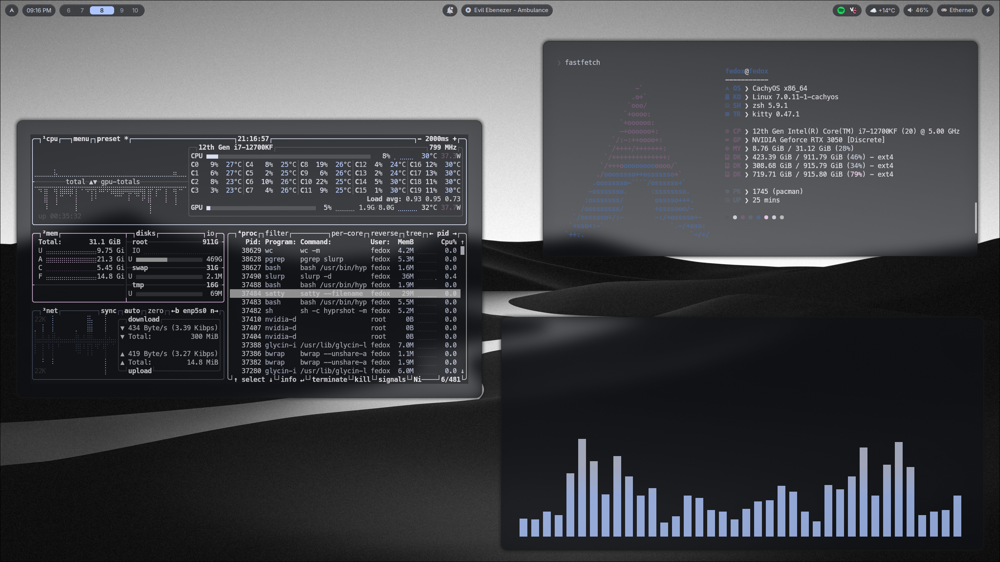
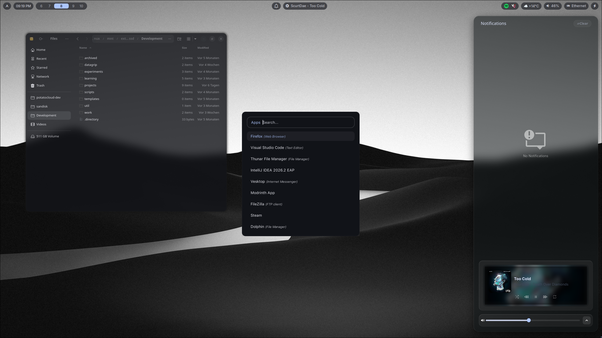
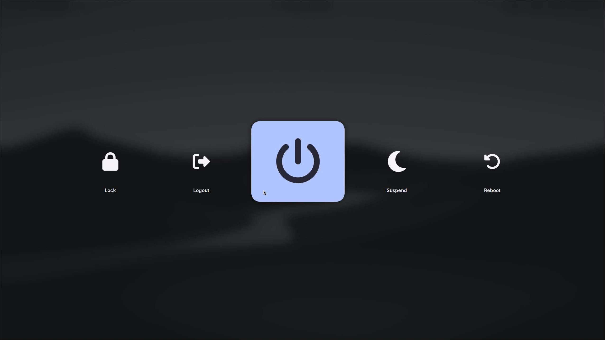
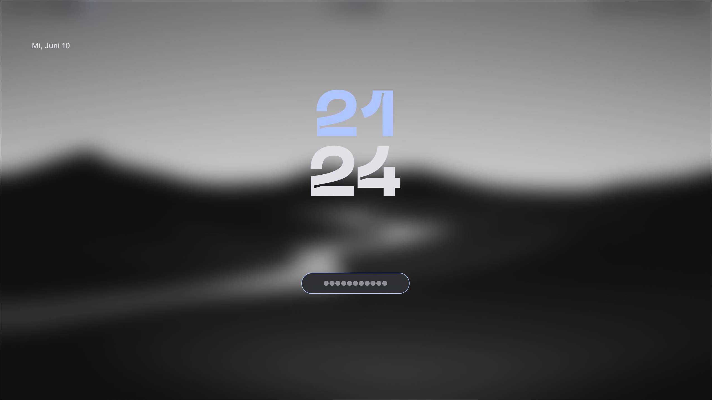

<h1 align="center">
    
    
      My Hyprland Configuration
    
    
       
   

      

      

         
         

          
      

       
   

</h1>

## Screenshots

More screenshots

## Color Switcher depending on the Wallpaper

