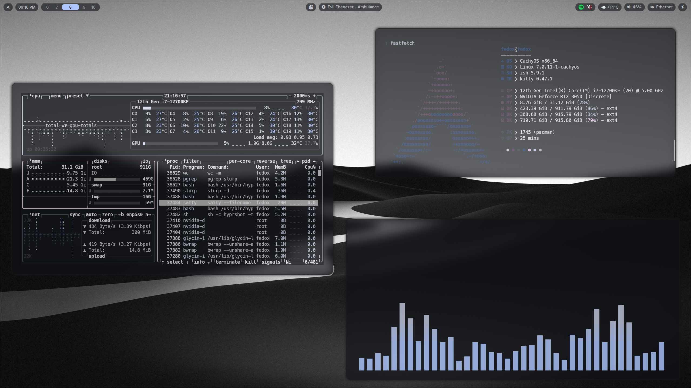
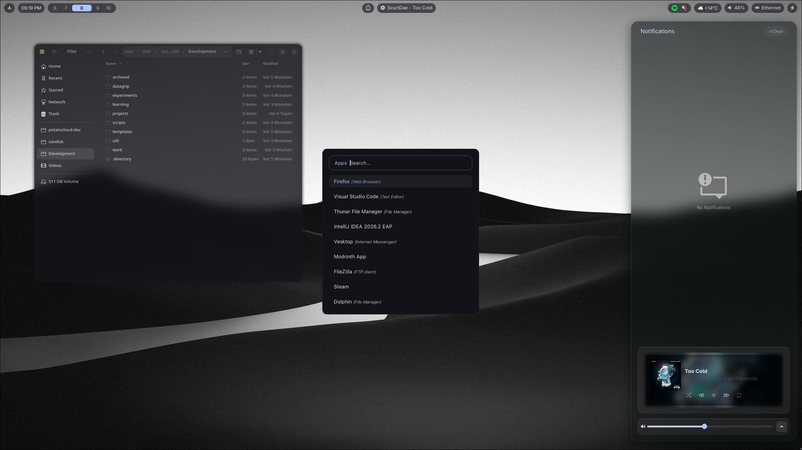
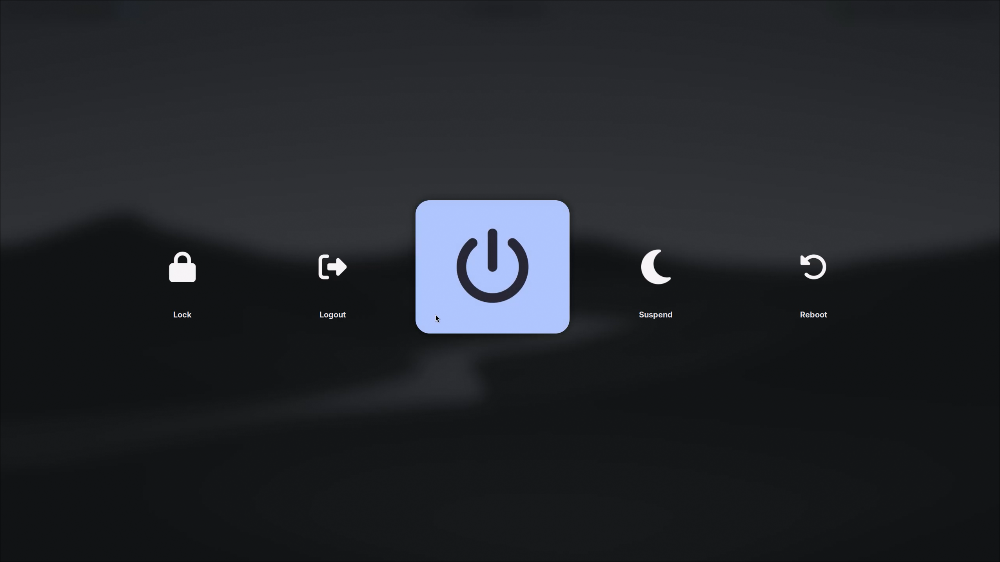
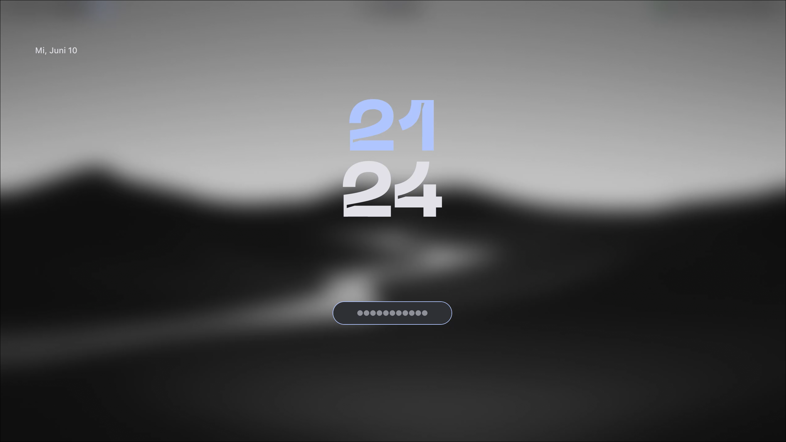
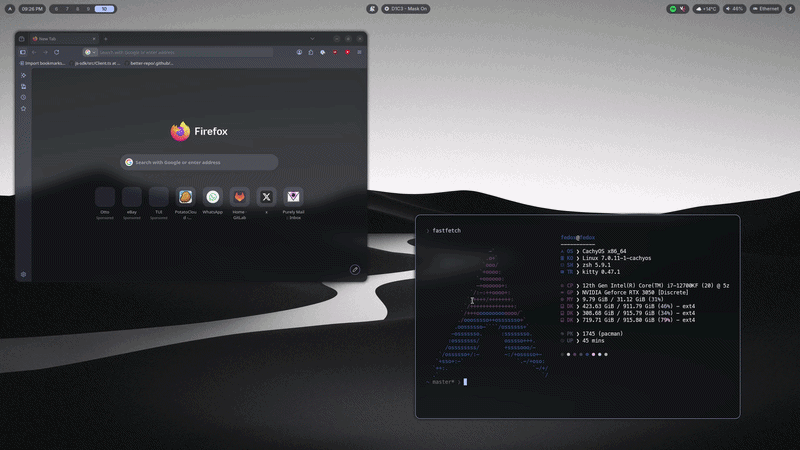

<h1 align="center">
    
   <br>
      My Hyprland Configuration
   <br>
    
   <br>   
   <div align="center">
      <p></p>
      <div align="center">
         
         <p></p>
          
      </div>
      <br>
   </div>
</h1>

## Screenshots




<details>
<summary>More screenshots</summary>




</details>

## Wallpaper-based theme



---

## What's inside

Every top-level folder is its own self-contained [GNU Stow](https://www.gnu.org/software/stow/) package — meaning you can link the whole setup, or just pick the one or two apps you actually care about.

> Colors across apps are generated from your wallpaper via `matugen` — that's the "wallpaper-based theme" above.

## Requirements
 
- [Hyprland](https://hyprland.org/) on Arch Linux (or an Arch-based distro)
- An AUR helper: [`paru`](https://github.com/Morganamilo/paru) or [`yay`](https://github.com/Jguer/yay)
- [GNU Stow](https://www.gnu.org/software/stow/) (installed automatically by `install.sh`)

## Installation
 
```bash
git clone https://github.com/feeeedox/dotfiles.git ~/dotfiles
cd ~/dotfiles
 
./install.sh   # installs all required packages via paru/yay
./stow.sh      # symlinks the configs into your $HOME
```

`stow.sh` opens an interactive menu so you can choose exactly which packages to link:

```
━━ available packages ──────────────────────
 
   1) btop
   2) fastfetch
   3) gtk
   4) hypr
   5) kitty
   ...
 
  select packages (numbers separated by space, 'a' for all, 'q' to quit):
```

Type e.g. `4 5 2` to link only `hypr`, `kitty` and `fastfetch`, or `a` to link everything.

## Just want to grab a single config?

You don't have to use Stow at all. Every package mirrors your home directory, so you can:

- **Cherry-pick a file** — e.g. just copy `hypr/.config/hypr/hyprland.lua` if you only want the Hyprland base config.

- **Stow a single package** without the menu:
```bash
  stow -d ~/dotfiles -t ~ kitty
```
- **Undo a link** at any time:
```bash
  ./stow.sh -D kitty
  # or: stow -D -d ~/dotfiles -t ~ kitty
```

- **Already have configs in place?** Stow will refuse to overwrite existing files by default. `stow.sh` will ask if you want to `--adopt` them (pulls your existing files into the repo so you can `git diff` and decide what to keep, instead of silently overwriting anything).

## Making changes
 
Since everything is symlinked, you can just edit the files directly under `~/.config/...` — you're actually editing the files inside `~/dotfiles`, so `git status` will pick up your changes right away. Nothing to copy back and forth.
 
To add a **new** package of your own:

1. Create a folder at the repo root named after the package (e.g. `nvim`).
2. Recreate the path it needs inside your home directory below it (e.g. `nvim/.config/nvim/init.lua`).
3. Run `./stow.sh nvim` (or pick it from the menu).

## License
 
[WTFPL](LICENSE)
