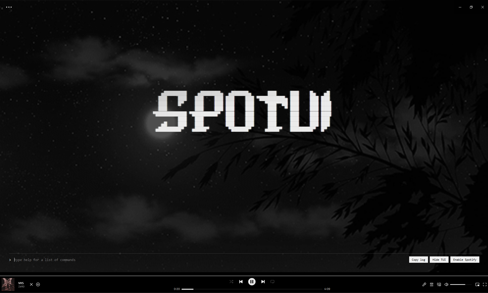

# SpoTUI

SpoTUI is a terminal-style Spotify skin built for Spicetify.

It combines:
- a custom UI overlay in `theme.js`
- theme styling in `user.css`
- Spotify color values in `color.ini`

## Screenshot


## 

## Features

- Terminal-inspired interface
- Fixed now-playing bar with live progress
- Built-in playback controls
- Track search without leaving the terminal
- Playlist browsing and management
- Six color schemes plus a fully customizable palette
- Command history with the arrow keys
- Tab autocomplete for commands and arguments
- Spotify-native fallback mode
- Copy-log and hide/show controls

## Installation

<details>
<summary>Linux</summary>

1. Open a terminal.
2. Go to your Spicetify themes directory:
   ```bash
   cd ~/.config/spicetify/Themes
   ```
3. Clone or pull this repo into that folder:
   ```bash
   git clone https://github.com/SouRyan/SpoTUI-By-SouRyan SpoTUI
   ```
   If you already have it locally, update it instead:
   ```bash
   cd SpoTUI
   git pull
   ```
4. Set SpoTUI as your current theme:
   ```bash
   spicetify config current_theme SpoTUI
   ```
5. Apply Spicetify:
   ```bash
   spicetify apply
   ```

</details>

<details>
<summary>Windows</summary>

1. Open PowerShell or Command Prompt.
2. Go to your Spicetify themes directory:
   ```powershell
   cd $env:APPDATA\spicetify\Themes
   ```
3. Clone or pull this repo into that folder:
   ```powershell
   git clone https://github.com/SouRyan/SpoTUI-By-SouRyan SpoTUI
   ```
   If you already have it locally, update it instead:
   ```powershell
   cd SpoTUI
   git pull
   ```
4. Set SpoTUI as your current theme:
   ```powershell
   spicetify config current_theme SpoTUI
   ```
5. Apply Spicetify:
   ```powershell
   spicetify apply
   ```

</details>
<details>
<summary>Marketplace</summary>

1. Open Spotify.
2. Go to the Spicetify Marketplace.
3. Select themes and search `SpoTUI`.
4. The only result will be the SpoTUI theme.

</details>

## Usage

After applying the theme, open Spotify and use the SpoTUI interface directly from the client.
Commands can be typed bare or prefixed with `/` or `.`. Use the arrow keys to walk through
your command history, `Tab` to autocomplete commands and arguments, and `help` to open the
command list in-app.

`Tab` expands a unique match (and inserts a trailing space when another argument is likely).
With several matches it fills the shared prefix, lists candidates on the status line, and
further `Tab` presses cycle through them — for example `th` → `theme `, then `n` → `nord`,
or `theme s` cycling `set` / `show` / scheme ids that start with `s`.

### Playback

| Command | Description |
| --- | --- |
| `play` / `pause` / `p` | resume, pause, or toggle |
| `skip` / `back` | next or previous track |
| `seek <pos>` | `mm:ss`, seconds, `50%`, `+15` or `-15` |
| `v <0-100>` / `volume <0-100>` | set volume |
| `shuffle` | toggle shuffle |
| `loop [on\|off]` | repeat the whole context |
| `superloop [on\|off]` | repeat the current track |
| `sleep <min\|off>` | pause playback after N minutes |

### Library and browsing

| Command | Description |
| --- | --- |
| `search <terms>` / `s <terms>` | search tracks in side panes; no terms opens the Spotify search |
| `add <terms>` | queue the top search result |
| `playlist` | browse playlists in side panes |
| `list` | current playlist tracks in side panes |
| `queue` | current queue in side panes |
| `like` / `unlike` | like track / album / playlist (pane selection or now playing) |
| `np` / `info` | dump now-playing details (the bar is always visible) |
| `home` / `recent` / `rec` / `top` | Made for you (Daily Mix, Discover Weekly…) + Recents |
| `lyrics [on\|off]` | synced lyrics panel (Spotify + lrclib); Esc closes |

### Interface

| Command | Description |
| --- | --- |
| `theme [name\|auto\|custom\|set …]` | switch or customize colors; no name opens the picker |
| `bg <url\|off>` | image or GIF behind the logo screen |
| `bar [on\|off]` | show or hide Spotify's bottom player bar (no arg toggles) |
| `mini [on\|off]` | floating SpoTUI miniplayer window (keeps your GIF backdrop) |
| `tui -m [command\|cli]` | hide or show the command log |
| `clear` | clear the log |
| `help [category\|command]` | browse commands by category |

`help` opens a category list mirroring the three tables above. Arrows move, `Enter` enters a
category, `Esc` goes back one level and then closes. You can also jump straight in with
`help library` or `help seek`.

`playlist`, `list`, `queue`, `search` and `home` open a two-pane layout above the now-playing
bar (left = source, right = tracks). `home` (also `rec` / `top`) loads Spotify’s **Made for
you** shelves — Daily Mix, Discover Weekly, etc. — plus **Recents** (recent playlists/albums).
`recent` jumps straight to the Recents block. In browse/home, moving through items previews
their tracks on the right; `Enter` starts playback. `Tab` / `Shift+Tab` or `←`/`→` switch
focus; arrows move inside the focused pane; `Enter` on a track plays it; `a` queues the
selected track from either pane; `l` toggles like on the focused item (track on the right,
album/playlist on the left); `u` unlikes; `n` creates a playlist (browse left pane only).
After drilling into an item with Enter, `Esc` clears the right pane; otherwise it exits panes
and returns to the logo. `theme`, `help` and new playlist still use modal popups.

`lyrics` opens SpoTUI’s own synced lyrics panel (not the Spotify sidebar). It tries Spotify’s
official lyrics first, then [lrclib](https://lrclib.net). The active line stays centered and
highlighted; `Esc` or `lyrics off` closes it. The open state is remembered across restarts.

## Backdrop

`bg` puts an image or animated GIF behind the ASCII logo. It only shows on the logo screen,
so switching to `tui -m cli` leaves the log on a plain background and readable.

```
bg https://example.com/loop.gif    set it
bg opacity 60                      how strongly it shows through (default 35)
bg                                 show what is set
bg off                             remove it
```

Only `http` and `https` URLs are accepted, and the image is loaded once before being applied,
so a broken link reports an error instead of leaving you with a blank backdrop. The URL and
opacity are saved, so the backdrop comes back when Spotify restarts.

## Color Schemes

SpoTUI ships with `SpoTUI - SkenS` (orange, default), `Matrix`, `Dracula`, `Gruvbox`,
`Nord` and `Mono`, plus a `Custom` palette you can edit live.

The quickest way to switch is the `theme` command, which repaints everything instantly and
remembers your choice:

```
theme nord          switch to Nord
theme               open the picker, arrows preview live, Enter keeps
theme auto          go back to following the Spicetify scheme
```

### Custom colors and fonts

Tune any color token yourself — accent, background, surface, text, muted, divider, error —
and choose the font used across the TUI, popups, lyrics, Spotify bar and miniplayer:

```
theme custom                          open the color editor
theme set accent #ff5500              change one token and switch to Custom
theme set bg #101010
theme show                            print the saved Custom palette
```

In the picker (`theme`), press `c` to customize starting from the highlighted scheme
(handy for tweaking Nord/Dracula/etc.). In the editor: arrows select a token, `Enter`
edits it, `s` saves, `r` resets to defaults, `Esc` cancels. Select `font` and press
`Enter` to open the font grid. The `Custom…` option accepts any installed font name.

The font picker includes terminal, accessibility and display families such as JetBrains Mono,
Cascadia Mono, Fira Code, Atkinson Hyperlegible, Open Dyslexic, Roboto, Geist and Ubuntu.
Web fonts are loaded when available; system-only fonts require that font to be installed.
The custom palette and font are stored in the browser and survive Spotify restarts.

You can also switch through Spicetify itself, which additionally recolors the parts of the
Spotify client that SpoTUI does not style, at the cost of a restart:

```bash
spicetify config color_scheme Nord
spicetify apply
```

Adding a preset scheme means editing two places: a section in `color.ini` (for Spicetify and the
Marketplace) and an entry in `SPOTUI_SCHEMES` in `theme.js` (for the `theme` command).

## Theme Files

- `theme.js` - JavaScript UI logic
- `user.css` - Spotify UI styling overrides
- `color.ini` - theme colors
- `preview.png` - Marketplace preview image

## Authors

- SouRyan - https://github.com/SouRyan
- SkenS - https://github.com/SkenSMasteR (original)
